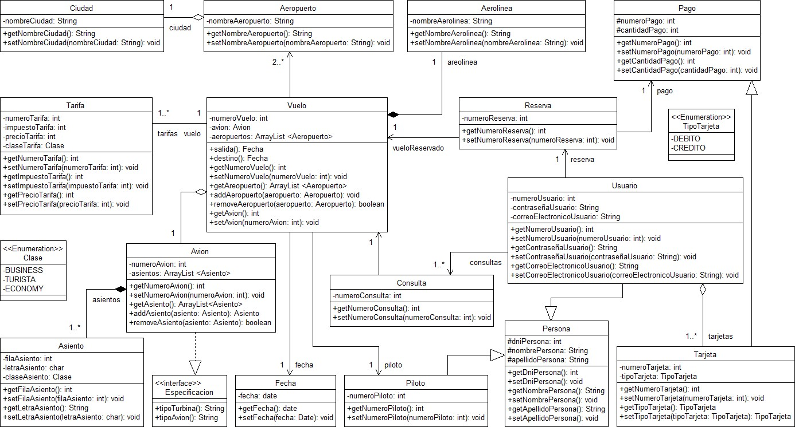

# Sistema Aerolínea — Spring Boot REST API

Sistema de gestión de aerolínea desarrollado como proyecto final universitario.
Permite administrar vuelos, reservas, usuarios, pilotos, aviones y toda la
infraestructura de una aerolínea mediante una API REST consumida por un frontend
HTML/CSS/JavaScript.

---

## Tecnologías utilizadas

| Componente | Tecnología |
|---|---|
| Lenguaje | Java 21 |
| Framework | Spring Boot 3.5.14 |
| ORM | Hibernate / Spring Data JPA |
| Base de datos | MySQL (XAMPP/MariaDB) |
| Mapeo DTO | ModelMapper 3.2.0 |
| Reducción boilerplate | Lombok |
| Validaciones | Jakarta Validation (`spring-boot-starter-validation`) |
| Frontend | HTML + Bootstrap 5.3.3 + JavaScript (fetch) |
| Build | Maven |
| IDE | IntelliJ IDEA |
| Documentación | JavaDoc |

---

## Arquitectura del proyecto

```
Browser (HTML/CSS/JS)
        ↕ HTTP JSON (fetch)
@RestController  ←→  @Service  ←→  JpaRepository  ←→  MySQL
        ↕
      DTOs
```

### Estructura de paquetes

```
com.aerolinea.SistemaAerolinea
├── config/         CorsConfig, DataLoader
├── controller/     16 controllers REST
├── dto/            16 DTOs
├── model/          16 entidades JPA
├── repository/     16 interfaces JpaRepository
├── service/        16 services
└── SistemaAerolineaApplication.java

src/main/resources/
├── static/
│   ├── index.html
│   ├── css/styles.css
│   └── js/app.js
└── application.properties
```

---

## Diagrama de clases



---

## Configuración y ejecución

### Requisitos previos
- Java 21
- Maven
- XAMPP con MySQL corriendo

### Configuración de la base de datos
El archivo `application.properties` ya está configurado para conectarse a MySQL local:

```properties
spring.datasource.url=jdbc:mysql://localhost:3306/sistema_aerolinea_sb?createDatabaseIfNotExist=true&serverTimezone=UTC
spring.datasource.username=root
spring.datasource.password=12345
spring.jpa.hibernate.ddl-auto=update
server.port=8080
```

> Si tu contraseña de MySQL es distinta, modificá `spring.datasource.password` antes de ejecutar.

### Ejecución
1. Iniciar XAMPP y activar el módulo MySQL
2. Ejecutar la aplicación desde IntelliJ o con `mvn spring-boot:run`
3. Abrir el navegador en `http://localhost:8080`

La base de datos se crea automáticamente. Al iniciar por primera vez, el `DataLoader`
carga datos de prueba automáticamente.

---

## Datos de prueba precargados (DataLoader)

Al iniciar la aplicación por primera vez se cargan automáticamente:

- 2 Aerolíneas: Aerolíneas Argentinas, LATAM
- 3 Ciudades: Mendoza, Buenos Aires, Córdoba
- 3 Aeropuertos: El Plumerillo, Ezeiza, Córdoba
- 3 Clases: ECONOMY, TURISTA, BUSINESS
- 2 Tipos de tarjeta: DEBITO, CREDITO
- 3 Personas, 2 Pilotos, 2 Aviones, 5 Asientos
- 2 Usuarios: `carlos@email.com` / `pass123` — `maria@email.com` / `pass456`
- 2 Vuelos con 3 tarifas
- 1 Reserva, 1 Consulta, 2 Tarjetas

---

## Endpoints de la API REST

Todos los endpoints siguen el patrón:

```
GET    /api/v1/{entidad}        → lista de entidades
GET    /api/v1/{entidad}/dto    → lista de DTOs (usar para el frontend)
GET    /api/v1/{entidad}/{id}   → entidad por ID como DTO
POST   /api/v1/{entidad}        → crear entidad
PUT    /api/v1/{entidad}/{id}   → actualizar entidad
DELETE /api/v1/{entidad}/{id}   → eliminar entidad
```

### Endpoints base disponibles

| Entidad | Endpoint base | Endpoints extra |
|---|---|---|
| Aerolínea | `/api/v1/aerolineas` | — |
| Aeropuerto | `/api/v1/aeropuertos` | — |
| Asiento | `/api/v1/asientos` | — |
| Avión | `/api/v1/aviones` | — |
| Ciudad | `/api/v1/ciudades` | — |
| Clase | `/api/v1/clases` | — |
| Consulta | `/api/v1/consultas` | `GET /usuario/{id}` |
| Pago | `/api/v1/pagos` | — |
| Persona | `/api/v1/personas` | — |
| Piloto | `/api/v1/pilotos` | — |
| Reserva | `/api/v1/reservas` | `GET /usuario/{id}`, `GET /vuelo/{id}` |
| Tarifa | `/api/v1/tarifas` | — |
| Tarjeta | `/api/v1/tarjetas` | — |
| TipoTarjeta | `/api/v1/tipos-tarjeta` | — |
| Usuario | `/api/v1/usuarios` | `GET /correo/{correo}` |
| Vuelo | `/api/v1/vuelos` | — |

---

## Validaciones del backend

Todas las entidades tienen validaciones con Jakarta Validation:

- Campos `String` obligatorios: `@NotBlank` + `@Size`
- Correo electrónico: `@Email`
- Campos numéricos positivos: `@Min(1)`
- Montos: `@DecimalMin("0.01")`
- Fechas obligatorias: `@NotNull`
- Relaciones obligatorias (`@ManyToOne`): `@NotNull`

Los controllers capturan los errores con `@ExceptionHandler(MethodArgumentNotValidException.class)`
y devuelven los mensajes de error al frontend en formato JSON con HTTP 400.

---

## Orden recomendado para cargar datos

El sistema tiene entidades con **dependencias entre sí**: algunas no pueden crearse
si otra entidad no existe primero porque sus formularios requieren seleccionar
registros relacionados. Si no se respeta el orden, los selectores aparecen vacíos
y el backend rechaza la operación con error de validación.

### Orden correcto:

| Paso | Entidad | Depende de | Sección en el frontend |
|---|---|---|---|
| 1 | Ciudad | — | Catálogo → Ciudades |
| 2 | Aerolínea | — | Catálogo → Aerolíneas |
| 3 | Clase | — | (precargada por DataLoader) |
| 4 | TipoTarjeta | — | (precargada por DataLoader) |
| 5 | Aeropuerto | Ciudad | Catálogo → Aeropuertos |
| 6 | Persona | — | Personal → Personas |
| 7 | Piloto | Persona | Personal → Pilotos |
| 8 | Avión | Aerolínea | Aviones |
| 9 | Asiento | Avión, Clase | Tarifas → Asientos |
| 10 | Usuario | Persona | Usuarios |
| 11 | Vuelo | Avión, Piloto, Aerolínea, Aeropuerto x2 | Vuelos |
| 12 | Tarifa | Vuelo, Clase | Tarifas |
| 13 | Pago | — | Pagos |
| 14 | Reserva | Usuario, Vuelo, Asiento, Pago | Reservas |
| 15 | Consulta | Usuario, Vuelo (opcional) | Consultas |
| 16 | Tarjeta | TipoTarjeta | Pagos → Tarjetas |

### Árbol de dependencias

```
Ciudad
  └── Aeropuerto
        └── Vuelo ◄───────────────────────┐
                                          │
Aerolínea                                 │
  └── Avión                               │
        ├── Asiento ──────────────── Reserva ◄── Pago
        └── Vuelo ────────────────────────┘
                                          │
Persona                                   │
  ├── Piloto ──────── Vuelo               │
  └── Usuario ───────────────────── Reserva
                                    Consulta
Clase
  ├── Asiento
  └── Tarifa (también necesita Vuelo)

TipoTarjeta ────────────────────── Tarjeta (extiende Pago)
```

---

## Documentación JavaDoc

La documentación JavaDoc se genera automáticamente con cada push a `master`
mediante GitHub Actions y se publica en GitHub Pages.

Para generarla manualmente:
```bash
mvn javadoc:javadoc
```
La documentación queda en `target/site/apidocs/index.html`.

---

## Notas de implementación

- **Patrón DTO:** todos los endpoints `GET` devuelven DTOs, nunca entidades directas,
  para evitar referencias circulares en la serialización JSON de las relaciones JPA.
- **Herencia JPA:** `Tarjeta extends Pago` usa `@Inheritance(strategy = InheritanceType.JOINED)`.
  El ID de Tarjeta es `idPago` heredado de Pago.
- **CORS:** configurado para permitir peticiones desde cualquier origen a `/api/**`.
- **DataLoader:** solo carga datos si la base está vacía (`count() == 0`), evitando
  duplicados al reiniciar la aplicación.
- 